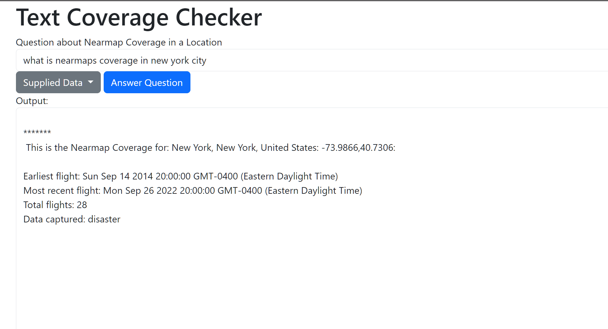

# Nearmap Text Based Coverage Check

Simple HTML and javascript site leveraging Nearmap Coverage API and Mapbox Geoloation API to enable a text based approach for simple coverage reports by Nearmap. This requires an API key for both Nearmap and Mapbox to use, hope to deploy this to an internal web app. 

## Contributing

Pull requests are welcome. For major changes, please open an issue first
to discuss what you would like to change.

## License

[MIT](https://choosealicense.com/licenses/mit/)